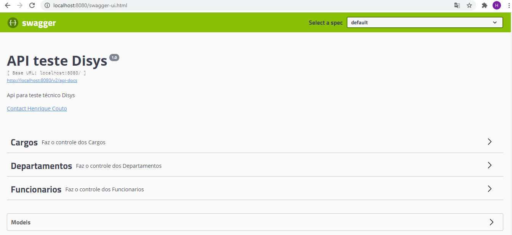

# Api - Disys

 Criar projeto webservice rest com spring boot.

######Disponibilizar swagger da aplicação.
######Criar crud de funcionário.
######Consulta de funcionários de um departamento.
######Manter histórico dos departamentos que o usuário trabalhou.
######Definir Chefe do departamento.

